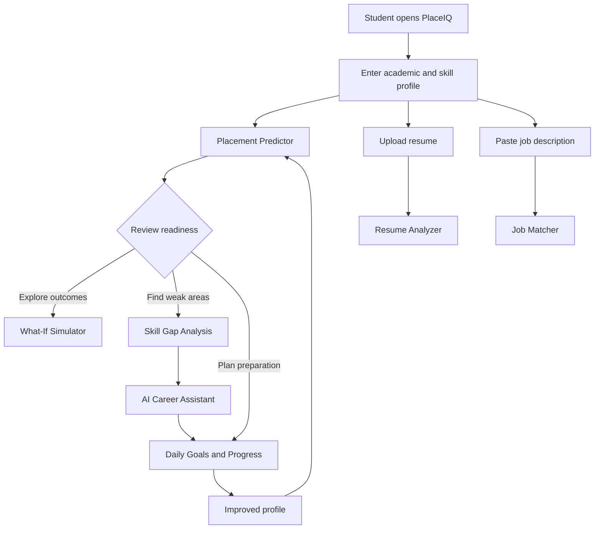
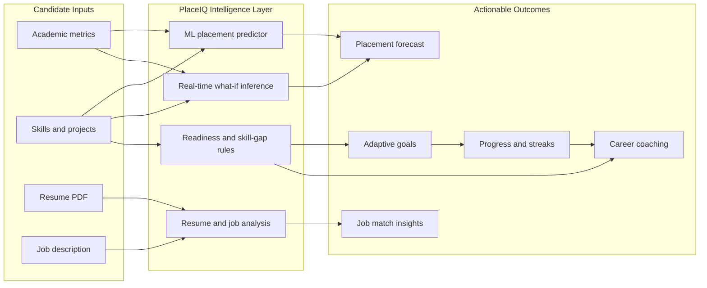

# PlaceIQ — AI Career Intelligence Platform

PlaceIQ is a premium campus placement readiness and career intelligence platform that combines a machine learning placement predictor with career guidance, adaptive goal planning, job matching, resume analysis, and progress tracking.

## Live Demo

Try the deployed application: [PlaceIQ AI Placement Predictor](https://48088202cbd3b0.lhr.life/)

The live interface brings the complete student journey into one workspace: assess placement readiness, test profile changes, identify skill gaps, get career guidance, match with jobs, analyze a resume, and track preparation progress.

The project keeps the existing application functionality intact while presenting a warm luxury editorial design system built around cream, beige, and dusty rose tones.

## Overview

PlaceIQ helps students evaluate their readiness for campus placements by combining:

- Machine learning-based placement prediction
- What-if scenario simulation
- Skill gap analysis and readiness diagnostics
- Daily adaptive goal generation
- Interview and career guidance assistant
- Job description matching
- Resume analysis
- Progress and habit tracking

## Application Flow



## Product Visualisation



### Interface Screenshots

The deployed experience includes the following primary views:

| Placement Predictor                                      | What-If Simulator                                                 |
| -------------------------------------------------------- | ----------------------------------------------------------------- |
| Enter candidate metrics and view the placement forecast. | Adjust profile sliders and compare simulated probability changes. |

To add the supplied browser captures to this section, place them in `docs/images/` with these names:

- `placement-predictor.png`
- `what-if-simulator.png`

Then use the following Markdown directly below this table:

```markdown


```

## Local Deployment

The frontend and backend are designed to run locally together:

- Frontend: http://localhost:5173
- FastAPI backend: http://127.0.0.1:8000
- Swagger docs: http://127.0.0.1:8000/docs

## Features

### Placement Predictor

- Predicts placement probability using a trained ML model
- Returns placement status, probability, and not-placed probability
- Uses feature-based scoring from academic and skill inputs

### What-If Simulator

- Lets users adjust profile attributes and see how scores change in real time
- Uses the same prediction endpoint without retraining the model

### AI Career Assistant

- Answers practical preparation questions using the candidate profile and progress context
- Supports a guided advice flow for weak areas, study planning, and interview prep

### Job Matcher

- Compares candidate skills against a job description
- Highlights matched and missing skill areas

### Resume Analyzer

- Uploads PDF resumes and analyzes content quality and readiness indicators
- Uses a backend parser and analysis pipeline

### Progress & Habits

- Tracks goal completion, study hours, streaks, and learning momentum
- Displays daily habit insights and adaptive planning

### Skill Gap Analysis

- Benchmarks profile metrics against placement readiness heuristics
- Highlights strong, moderate, and weak areas

## Tech Stack

### Frontend

- React
- Vite
- Tailwind CSS
- React Icons
- Recharts
- Canvas Confetti

### Backend

- FastAPI
- Uvicorn
- Pandas
- Joblib
- Scikit-learn
- Pydantic
- PyPDF

## Project Structure

```text
placement_predictor/
├── backend/
│   ├── career_assistant.py
│   ├── job_matcher.py
│   ├── main.py
│   ├── placement_model.pkl
│   ├── requirements.txt
│   ├── resume_analyzer.py
│   └── default_values.pkl
├── frontend/
│   ├── index.html
│   ├── package.json
│   ├── postcss.config.js
│   ├── tailwind.config.js
│   ├── vite.config.js
│   ├── public/
│   └── src/
├── save_whatif.py
├── README.md
├── start-project.ps1
└── .gitignore
```

## Requirements

### Node.js

- Install Node.js 18+ recommended

### Python

- Python 3.10+ recommended
- For local project setup, Python 3.14 was used in this environment

## Local Setup

### 1. Install Python dependencies

From the project root:

```bash
C:/Python314/python.exe -m pip install -r backend/requirements.txt
```

### 2. Install frontend dependencies

```bash
cd frontend
npm install
```

### 3. Start the backend API

From the project root:

```bash
C:/Python314/python.exe -m uvicorn backend.main:app --host 0.0.0.0 --port 8000
```

### 4. Start the frontend app

In a second terminal:

```bash
cd frontend
npm run dev -- --host 0.0.0.0
```

### 5. Open the app

Visit:

- http://localhost:5173

Swagger docs are available at:

- http://127.0.0.1:8000/docs

## Quick Launch Script

A helper PowerShell launcher is included at the project root:

```powershell
./start-project.ps1
```

This starts the backend and frontend together in new PowerShell sessions.

## Deployment Notes

The application is deployed at the live demo URL above and can also be run locally for development.

The current runtime configuration uses:

- Frontend Vite dev server on port 5173
- FastAPI backend on port 8000
- Same-origin style frontend calls to the backend through the configured API URL

## Important Constraints

This project is designed to preserve the current behavior and functionality:

- ML model remains unchanged
- Backend logic remains unchanged
- Prediction contract remains unchanged
- Feature flow remains intact
- Theme redesign focuses on styling and presentation only

## License

This project is intended for internal demo and educational use unless a separate license is provided.

## Contact / Usage

Use the app to evaluate placement readiness, simulate profile changes, and guide preparation strategy based on real candidate metrics.
